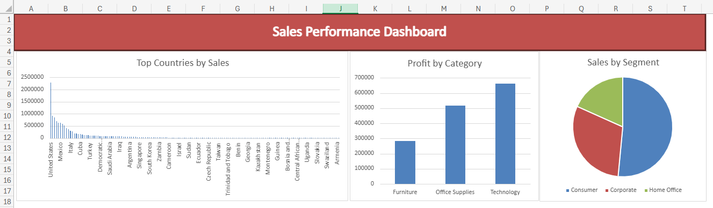
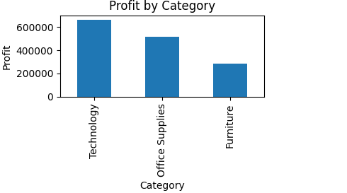
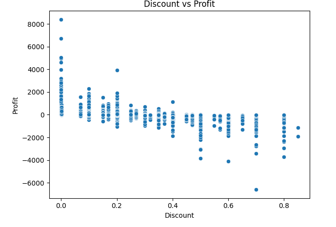
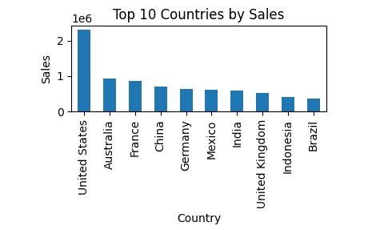
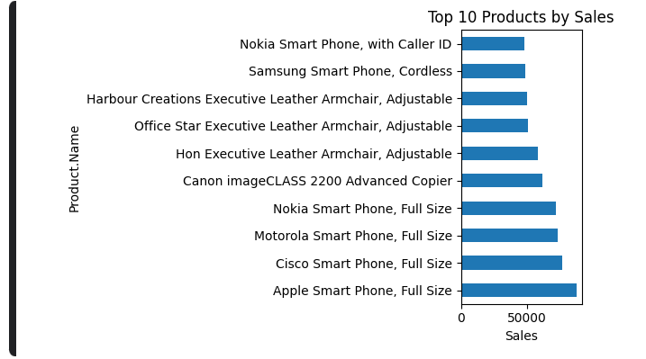
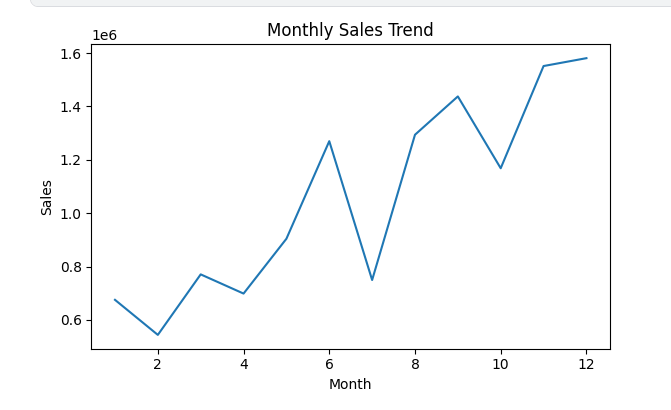

# Global Superstore Sales Analysis

## Overview
This project analyzes the Global Superstore dataset using Python, SQL, and Excel.
The analysis focuses on sales performance, profitability, customer behavior, 
product performance, and business insights through data visualization and dashboard creation.

## Tools Used
- Python (Kaggle Notebook)
- SQL Online
- Microsoft Excel Online

## Dataset
Global Superstore Dataset — 51,290 records
- Orders, Customers, Products, Sales, Profit, Shipping, Countries and Regions

---

## Project Structure

global-superstore-sales-analysis

├── data
│ └── clean_superstore.csv

├── notebook
│ └── superstore_analysis.ipynb

├── sql
│ └── sql_queries.sql

├── images
│ ├── 01_profit_by_category.png
│ ├── 02_discount_vs_profit.png
│ ├── 03_top_countries_by_sales.png
│ ├── 04_top_10_products_sales.png
│ ├── 05_shipping_cost_vs_profit.png
│ ├── 06_monthly_sales_trend.png
│ ├── 07_top_customers_sql.png
│ ├── 08_profit_by_shipping_mode_sql.png
│ ├── 09_top_products_sales_sql.png
│ ├── 10_top_countries_profit_sql.png
│ ├── 11_category_profit_analysis_sql.png
│ ├── 12_yearly_sales_sql.png
│ └── 13_sales_dashboard_excel.png

---

## Python Analysis
- Data Cleaning
- Exploratory Data Analysis (EDA)
- Profit by Category
- Discount vs Profit Analysis
- Top Countries by Sales
- Top Products by Sales
- Shipping Cost vs Profit
- Monthly Sales Trend

## SQL Analysis
- Top Customers
- Product Performance
- Country Performance
- Profit by Category
- Profit by Shipping Mode
- Yearly Sales Trends

## Excel Dashboard
An Excel dashboard was created to summarize key business insights 
using charts and pivot tables.

### Dashboard Preview

## Key Insights
- Technology generated the highest profit (~$650,000) among all categories
- Office Supplies came second (~$500,000) followed by Furniture (~$300,000)
- United States is the top country by sales with ~$2.3M
- Apple Smart Phone Full Size is the best selling product (~$70,000)
- Discounts above 40% are strongly associated with negative profit (losses)
- Sales generally increased toward the end of the year

## Decision & Recommendations
- Focus marketing efforts on Technology products as they drive most profit
- Review discount strategy — discounts above 40% cause losses
- Expand operations in top markets: USA, Australia, France
- Consider reducing Furniture discounts as it has the lowest profit

## Visualizations

### Profit by Category

### Discount vs Profit

### Top Countries by Sales

### Top 10 Products by Sales

### Monthly Sales Trend

